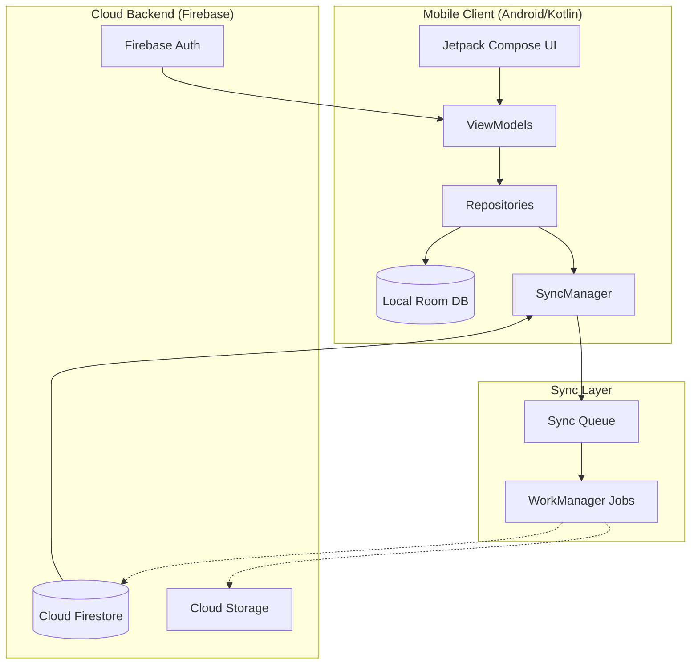

# Shoshin App Architecture & Database Documentation

This document provides a detailed breakdown of the technical structure of the Shoshin App, including the backend services, local database schema, and data flow logic.

## 1. High-Level System Architecture

The app follows a **Local-First with Cloud Sync** architecture. This ensures high performance and offline capability while maintaining social features and cross-device consistency.

## 2. Data Storage Structure

### A. Local Database (SQLite via Room)
Located in `com.example.shoshinapp.data.db`, the local database mirrors the cloud structure for offline access.

| Table Name | Primary Key | Key Fields | Purpose |
| :--- | :--- | :--- | :--- |
| **users** | `userId` | `displayName`, `currentStreak`, `streakFreezes`, `inviteCode` | Profile & local stats |
| **streaks** | `streakId` | `date`, `completed`, `timestamp` | Daily habit tracking history |
| **groups** | `groupId` | `groupName`, `description`, `inviteCode` | Accountability circles |
| **group_members**| `(gId, uId)` | `consistencyStreak`, `activations` | Real-time member stats |
| **group_posts** | `postId` | `content`, `photoUrl`, `syncStatus` | Social feed items |
| **user_badges** | `badgeId` | `unlockedDate`, `progress` | Gamification tracking |
| **sync_queue** | `queueId` | `action`, `payload`, `timestamp` | Reliability layer for sync |

### B. Cloud Backend (Firebase Firestore)
The NoSQL structure in Firestore is optimized for fast lookups and real-time updates.

- **`users/{userId}`**: Profile documents.
    - `limits/current`: Sub-collection for referral-based rewards.
- **`groups/{groupId}`**: Core group metadata.
    - `members/{userId}`**: Real-time stats sub-collection.
    - `posts/{postId}`**: Group message and photo sub-collection.
- **`referralCodes/{code}`**: Mapping for invite code lookups.

## 3. Core Logic Flows

### User Onboarding & Identity
1. **Auth**: Firebase Auth (Phone/Google) generates a `UID`.
2. **Initialization**: `handleNewUser` creates both the Firestore document and the local `UserEntity`.
3. **Referral**: Links the new user to their referrer and updates `UserLimits`.

### Morning Flow & Streak Logic
1. **Activation**: User starts the morning practice.
2. **Checkpoints**: Progress is saved locally to `CheckpointEntity`.
3. **Completion**: `StreakViewModel` increments `currentStreak` and updates `lastCheckpointDate`.
4. **Celebration**: If a milestone is hit, `BadgeUnlockScreen` is triggered.

### Social Synchronization
1. **Writing**: Repositories write to local DB and add an item to the `sync_queue`.
2. **Background**: `SyncWorker` (via WorkManager) attempts to push the queue to Firestore.
3. **Reading**: `SyncManager` uses Firestore snapshots to stream remote changes (like friend streaks or group posts) back into the local database.

## 4. Backend Services Used
- **Firebase Auth**: Identity management.
- **Cloud Firestore**: Real-time database.
- **Cloud Storage**: Image hosting (Profile pics/Proof photos).
- **Firebase Analytics**: User behavior tracking.
- **Firebase App Check**: Security & Play Integrity (managed via reCAPTCHA in test).

---
*Created for Shoshin Technical Documentation — 2024*
